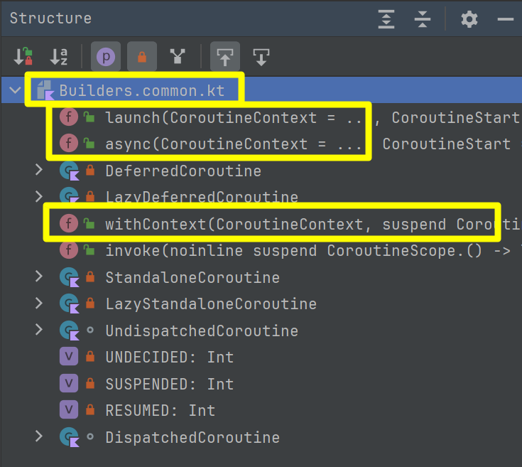
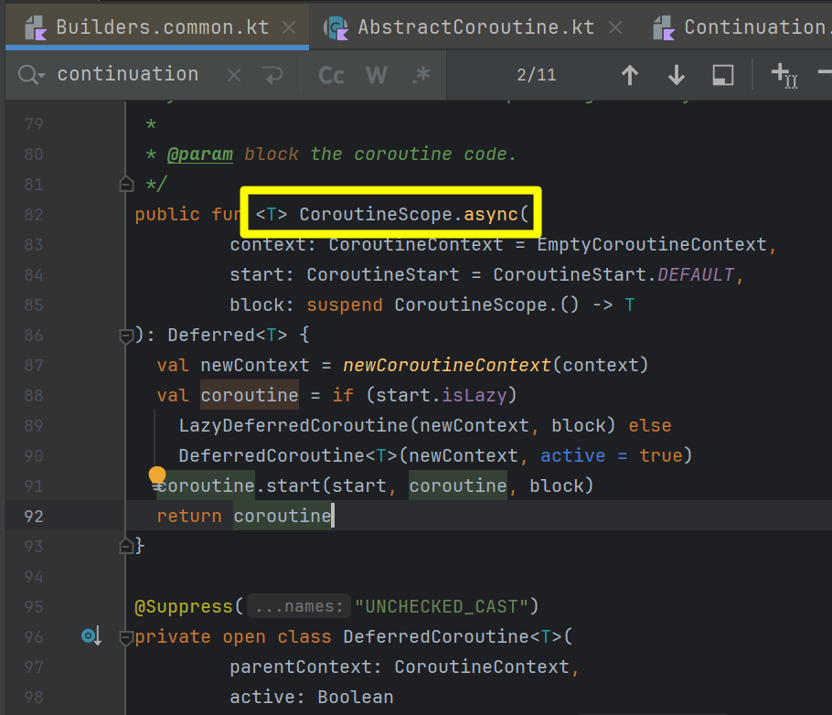
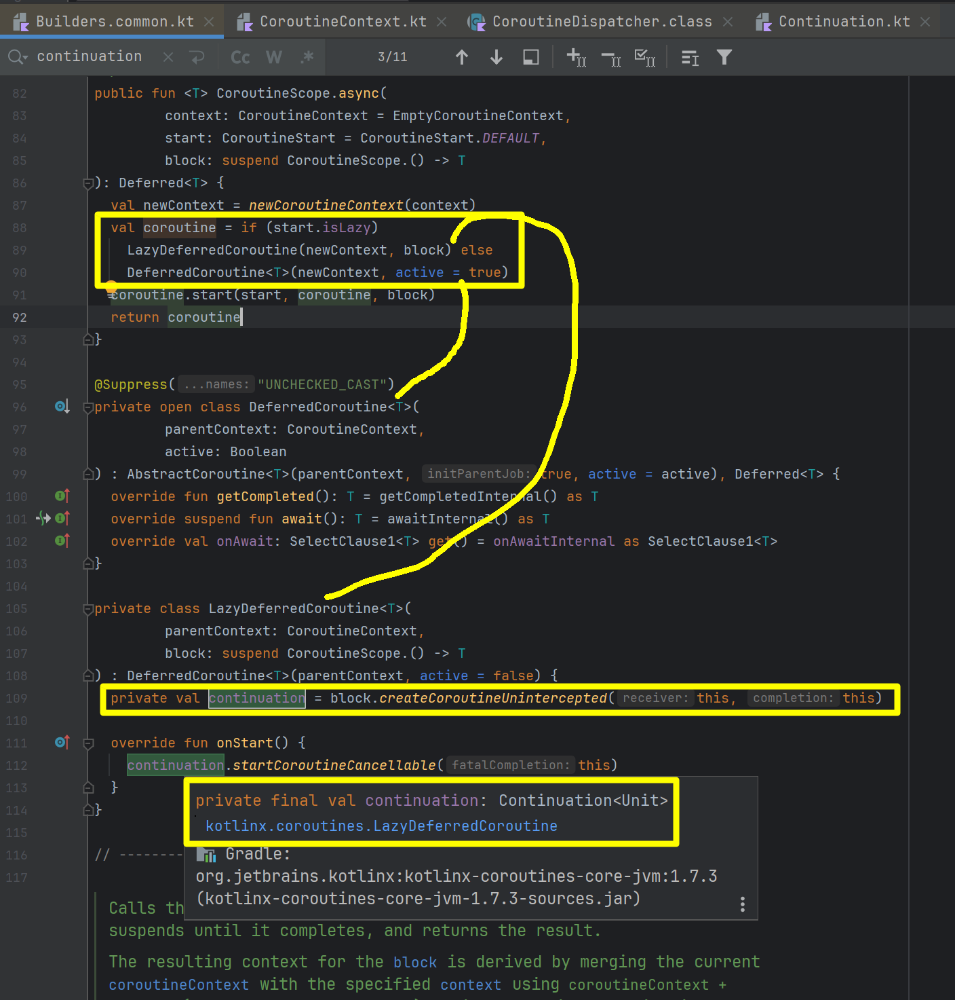
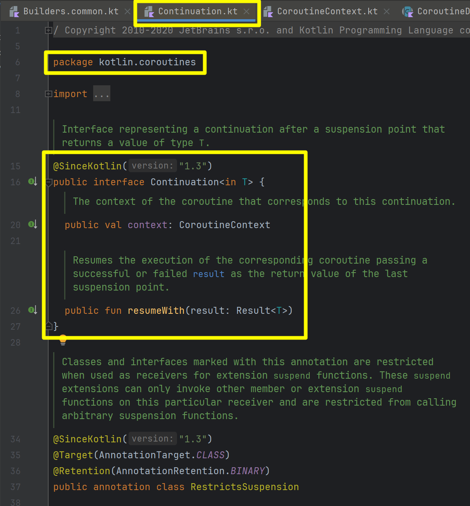

## `async{ ... }` 함수는 `Builders.common.kt` 에 있다.

`kotlinx.coroutines` 패키지에 위치해있다. 

`kotlinx.coroutines` 패키지 내의 `Builders.common.kt` 파일에 launch, async, withContext 등과 같은 suspend 함수들이 있다.

 

## async 는 CoroutineScope 에 대해 선언한 확장함수다.

 

## e.g. async 내에서 실제로 Continuation 을 사용할까?

사용한다. 

async 함수 내에서도 Callstack을 타고 내려가다 보면 결국은 내부적으로 Continuation 을 사용하고 있다는 것을 알 수 있는 코드가 있다.

코드를 보면 async 함수에서 coroutine 객체 생성 시에 start.isLazy 일 때 LazyDeferredCoroutine 객체를 생성하는데 이 LazyDeferredCoroutine 객체의 내부를 보면 continuation 객체를 만들어서 `continuation.startCoroutineCancellable(this)` 를 호출하고 있다.

 

## Continuation\<Unit\>

Continuation\<Unit\> 은 `kotlin.coroutines` 패키지에 정의되어 있는 interface 다.

