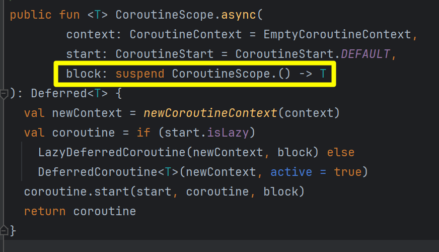

## CoroutineContext

자바에서는 Thread 에서 공유할 데이터를 ThreadLocal 을 통해 공유합니다. 하지만 suspend 함수에서 코루틴 기반의 연산을 할 경우에는 이것이 불가능합니다. 코틀린에서는 코틀린의 코루틴에서 사용되는 하나의 데이터 문맥을 CoroutineContext 라고 부릅니다.<br/>

그리고 이 CoroutineContext 는 Java 의 ThreadLocal 처럼 전역적으로 공유하는 것이 아니라 어떤 코루틴에서 생성했는지 여부 등에 따라서 지역적인 특성을 가집니다. <br/>

개인적으로는 코틀린의 코루틴을 처음 접할 때 이런 점이 Java 보다는 더 매력적으로 느껴졌던 것 같습니다. <br/>

<br/>


## ThreadLocal

Kotlin 의 코루틴은 `runBlocking` 을 사용할 경우를 제외하고는  Java 의 ThreadLocal 을 이용해 스레드 레벨에서의 Context 공유는 불가능합니다. 대신 ThreadLocal 을 CoroutineContext 를 통해 표현한 코틀린 버전의 ThreadLocalElement 라는 CoroutineContext 객체가 있기는 합니다.<br/>

e.g.

```java
package io.chagchagchag.demo.kotlin_coroutine.coroutine_context

import io.chagchagchag.demo.kotlin_coroutine.helper.logger
import kotlinx.coroutines.Dispatchers
import kotlinx.coroutines.launch
import kotlinx.coroutines.runBlocking


fun main(){
  val log = logger()
  
  val isGreen = ThreadLocal<String>()
  isGreen.set("Yes")

  runBlocking {
    // 1)
    log.info("현재 스레드 = {}", Thread.currentThread().name)
    log.info("isGreen == {}", isGreen.get())
    assert(isGreen.get() != null)

    // 2)
    launch (Dispatchers.IO){
      log.info("현재 스레드 = {}", Thread.currentThread().name)
      log.info("isGreen = {}", isGreen.get())
      assert(isGreen.get() == null)
    }
  }
  
}
```

<br/>


출력결과

```plain
20:34:55.017 [main] INFO io.chagchagchag.demo.kotlin_coroutine.helper.LoggerDump -- 현재 스레드 = main
20:34:55.021 [main] INFO io.chagchagchag.demo.kotlin_coroutine.helper.LoggerDump -- isGreen == Yes
20:34:55.037 [DefaultDispatcher-worker-1] INFO io.chagchagchag.demo.kotlin_coroutine.helper.LoggerDump -- 현재 스레드 = DefaultDispatcher-worker-1
20:34:55.038 [DefaultDispatcher-worker-1] INFO io.chagchagchag.demo.kotlin_coroutine.helper.LoggerDump -- isGreen = null
```

<br/>

1\) 과 2\) 에서 각각 사용된 스레드가 다르다는 것을 확인 가능합니다.<br/>


1\) 

- 1\) 에서 호출한 결과는 ThreadLocal 의 변수를 제대로 가져옵니다.
- 그리고 현재 스레드의 이름을 출력해본 결과 main 으로 나타납니다.
- runBlocking 이라는 코루틴 빌더는 main 스레드에서 실행되기 때문에 ThreadLocal 을 사용가능하고, main 스레드에서 실행할 수 있습니다.
- 하지만 블로킹 방식이라는 점에 주의해야 합니다.

2\) 

- 2\) 에서 호출한 결과는 main 클래스에서 선언한 ThreadLocal 변수의 값을 가져오지 못합니다.
- main 스레드에서 실행되는 것이 아니기 때문입니다.
- launch, async 같은 suspend 함수들은 main 스레드에서 실행되지 않고 코루틴에서 실행됩니다.
- 코루틴은 내부적으로 다른 스레드에서 실행되고 코루틴 자신이 실행될 스레드 역시 CoroutineDispatcher 에 의해 바뀔 때도 있습니다. 따라서 ThreadLocal 변수를 공유하는 것이 불가능에 가깝습니다.

<br/>


## suspend 함수 내에서 CoroutineContext 를 어떻게 접근하나요?

suspend 키워드가 적용된 함수 내에서는 `coroutineContext` 라는 변수에 접근 가능합니다.<br/>

```kotlin
package io.chagchagchag.demo.kotlin_coroutine.coroutine_context

import io.chagchagchag.demo.kotlin_coroutine.helper.logger
import kotlinx.coroutines.runBlocking
import kotlin.coroutines.coroutineContext
import kotlin.coroutines.resume
import kotlin.coroutines.suspendCoroutine

fun main(){
  val log = logger()
    
  // (1)
  runBlocking {
    log.info("현재 코루틴 스코프 내의 코루틴 컨텍스트 : ${this.coroutineContext}")
    inner() // 다른 함수를 호출할 때 어떻게 되는지 확인해봅니다.
  }
}

private suspend fun inner(){
  val log = logger()
  // (2)
  log.info("suspend 함수 내에서의 context ${coroutineContext}")

  // (3)
  var result = suspendCoroutine<String> { continuation ->
    log.info("Continuation 객체 내의 context = ${continuation.context}")
    continuation.resume("OK")
  }
}
```


(1)

- (1) 에서는 `runBlocking{...}` 함수 내에서 코루틴 컨텍스트에 접근하는데, `coroutineContext` 변수로 접근했다는 것을 알 수 있습니다. runBlocking 함수의 마지막 인자는 람다인데, 이 람다 내에서 coroutineContext 필드를 접근하고 있는 것을 알 수 있습니다.

(2)

- (2) 에서는 일반 suspend 함수에서 coroutineContext 에 접근하는 것을 보여줍니다. suspend 함수 내에서는 단순히 `coroutineContext` 필드를 사용해서 코루틴 컨텍스트데 접근 가능합니다.

(3)

- (3) 에서는 `suspendCoroutine` 함수를 실행하고 있는데, `suspendCoroutine` 함수의 마지막인자인 람다를 이용하고 있습니다. 이 람다의 첫번째 인자는 `continuation` 타입인데, 이 continuation 타입 내의 `context` 필드를 통해서 CoroutineContext 필드에 접근이 가능합니다.

<br/>


위의 코드에 대한 출력결과는 아래와 같습니다.

```plain
21:33:20.779 [main] INFO io.chagchagchag.demo.kotlin_coroutine.helper.LoggingObject -- 현재 코루틴 스코프 내의 코루틴 컨텍스트 : [BlockingCoroutine{Active}@5ec0a365, BlockingEventLoop@4fe3c938]
21:33:20.784 [main] INFO io.chagchagchag.demo.kotlin_coroutine.helper.LoggingObject -- suspend 함수 내에서의 context [BlockingCoroutine{Active}@5ec0a365, BlockingEventLoop@4fe3c938]
21:33:20.786 [main] INFO io.chagchagchag.demo.kotlin_coroutine.helper.LoggingObject -- Continuation 객체 내의 context = [BlockingCoroutine{Active}@5ec0a365, BlockingEventLoop@4fe3c938]
```

<br/>


## async, launch 등의 코루틴 빌더는 왜 `{}` 으로 끝나나요?

async 함수를 예로 들어보겠습니다. `kotlin-coroutines-core` 라이브러리에서 제공하는  `Builders.common.kt` 파일 내의 async 함수는 아래와 같이 정의되어 있습니다.



마지막 인자는 `suspend CoroutineScope.() -> T` 와 같이 선언되어 람다로 선언되어 있음을 확인 가능합니다.<br/>

코틀린 문법을 정리하면서 자세히 정리하겠지만, 코틀린에서는 함수의 마지막인자가 람다일 경우 `()` 으로 감싸지 않고 `{ }` 으로 끝낼 수 있습니다. 위의 코드에서는 세개의 인자들 중 context, start 는 모두 디폴트 값이 정해져 있고, 마지막 인자는 람다입니다. 따라서 async (...) 함수를 호출할 때에는  아래와 같은 식으로 표현하는 것이 가능해집니다.

```kotlin
fun main(){
    async{ // 여기부터 있는 람다 바디는 사실 async() 함수의 마지막 인자에요!!
        println("안뇽하세요")
    }
}
```

<br/>


그리고 `kotlin-coroutine-core` 에서 제공하는 async, launch, withContext 등과 같은 코루틴과 관련된 함수들을 코루틴 빌더라고 부릅니다.<br/>

<br/>


