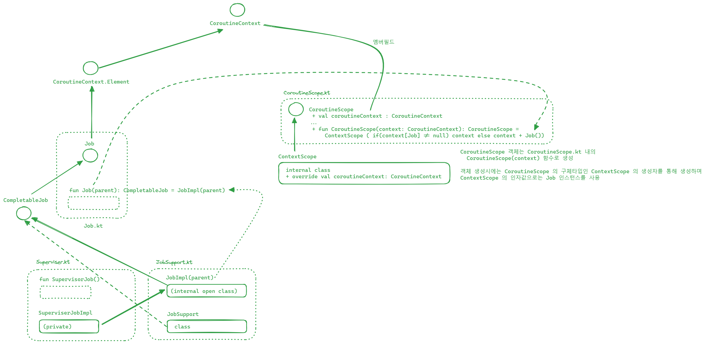

## CoroutineScope

CoroutineScope 는 Coroutine 의 Scope 를 정의하는 용도의 타입이며 interface 로 선언되어 있습니다.

structured concurrency 라고 해서 중첩된 Coroutine Scope 를 가질 수도 있는데 여기에 대해서는 예제를 통해 정리해봅니다. CoroutineScope 를 만들때에는 보통 Coroutine Builder 라고 불리는 함수를 사용하는데 대부분 CoroutineScope interface 에 확장함수로 추가된 함수이며 `withContext()`, `launch()`, `async()` 등이 있습니다. `withContext()`, `launch()`, `async()` 확장함수의 정의는 [Builders.common.kt](https://github.com/Kotlin/kotlinx.coroutines/blob/master/kotlinx-coroutines-core/common/src/Builders.common.kt) 에 정의되어 있습니다. 

## UML - CoroutineScope 와 CoroutineContext 의 연관관계

CoroutineScope 는 내부에 CoroutineContext 를 잡고 움직입니다. 당연하게도, 스코프를 관리하는 데에 있어서 Context(문맥)이 필요하기 때문입니다. 그리고 CorutineScope 는 interface 이기에 직접 객체 생성이 불가능한데, 실제로는 구체타입인 ContextScope 객체로 생성하며, ContextScope 객체를 생성하는 함수는 `CoroutineScope.kt` 내에 CoroutineScope(context) 라는 함수에서 수행합니다. 

코틀린은 특이하게도 interface 안에서 생성자처럼 보일 수 있는 함수들을 선언하고 특정 기본 구현체를 생성하는 객체 생성 함수들을 interface 내에서 제공하도록 구현하는게 관례처럼 되어 있는 라이브러리들이 많습니다. 

이렇게 ContextScope 객체를 만들 때에는 Job 인스턴스가 필요합니다. 당연하게도 코루틴을 구동시키려면 Job 이 필요하겠죠. 이 때 Job 인스턴스는 `Job.kt` 파일 내의 `Job(CoroutineContext)` 함수를 통해 생성합니다. 실제로 내부적으로는 콜 스택을 한 번 더 타서 `JobSupport.kt` 내의 JobImpl(parent) 라는 함수를 통해 실질적인 객체를 생성합니다. 

 

요약해서 필요한 내용만 요약해보면 이렇습니다.

- CoroutineScope 내에는 CoroutineContext 정보가 필요한데, 따라서 CoroutineContext 타입에는 항상 멤버 필드 coroutineContext 가 있다.
- CoroutineScope 는 interface 이기에 구체타입으로 객체를 생성해야 하는데, 내부 구현상으로 기본적으로는 ContextScope 객체를 이용해 CoroutineScope 타입이 생성된다.
- ContextScope 라는 구체 타입의 CoroutineScope 가 생성될 때 `Job` 객체를 주입받아서 이것을 멤버 필드인 `coroutineContext` 에 초기화 한다. Job 객체 역시 상위 타입이 CoroutineContext 이기에 coroutineContext 에 저장하는 것이 가능하다.

 

## CoroutineScope 빌더 함수들

## 간단한 예제

## launch 의 동작

## async 의 동작

